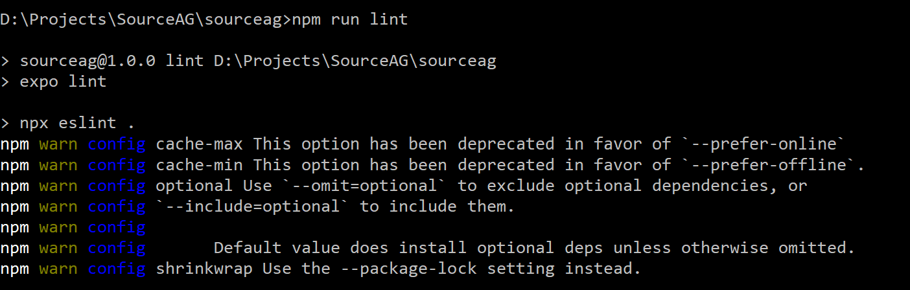
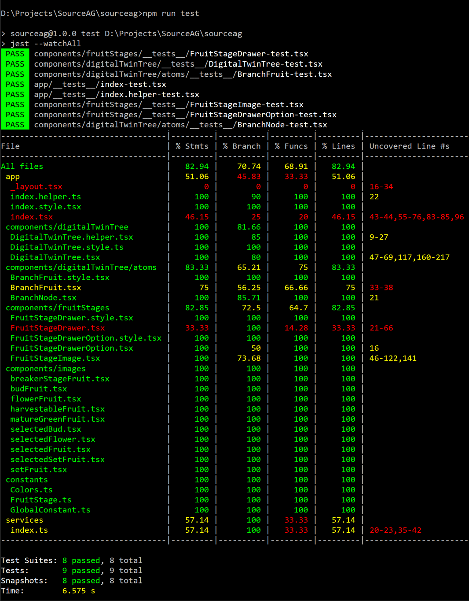
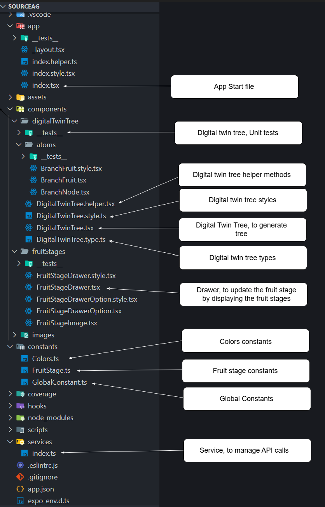

# Welcome to your Source AG Expo app 👋

This is an [Expo]() project created for Source AG test assignment.

## To get started

1. Install dependencies, please run below command in terminal

   npm install

2. Start the app

   npx expo start

In the output, you'll find options to open the app in a

- [Android emulator]()
- [iOS simulator]()
- [Expo Go](), a limited sandbox for trying out app development with Expo

## Technical Stack

Used framework or libraries listed below for this project.

1. Expo - Official React Native team recommends Expo as a framework to begin the project.
2. Typescript - programming language
3. Expo Router - file based navigation, for screen navigation
4. Axios - to call backend REST APIs
5. SVG - Scaler vector graphics, are used to generate tree stems and nodes.

## Code Standard

ESlint was used for code standards; no Lint issues were discovered.

## Unit testing

For unit testing, the Jest and React testing libraries were used. No major issue found.

## Project Structure

## Testing Done

1. App will work in portrait mode only.
2. Enabled for tablets, by enabling in app.json
   "ios": {
   "supportsTablet": true
   },
   To support Android, need to manages from Play Store
3. All testing done on iPhone 15 with Expo Go (due to no tablet device available)
