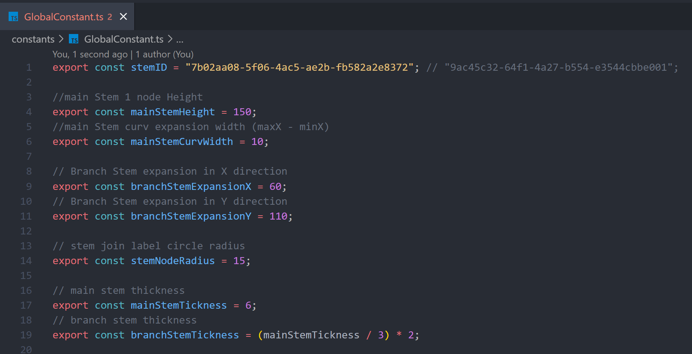
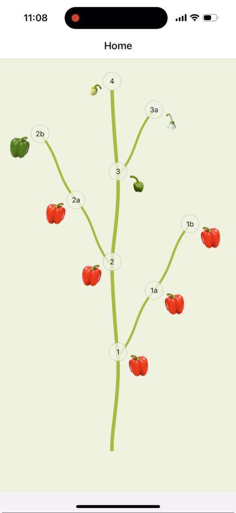

# Source AG Assignment App

This is an app created for Source AG assignment.

## To run app

1. Install dependencies, please run below command in terminal

   npm install

## To test app

1. to Start the app, please run below command in terminal

   npm start

In the output, will find options to open the app in a

- [Android emulator]()
- [iOS simulator]()
- [Expo Go](), a limited sandbox for trying out app development with Expo

## Technical Stack

Used framework or libraries listed below for this project.

1. Expo - Official React Native team recommends Expo as a framework to begin the project.
2. Typescript - programming language.
3. Expo Router - file based navigation, for screen navigation.
4. Axios - to call backend REST APIs.
5. SVG - Scalable Vector Graphics, are used to generate tree stems and nodes.

## Assumptions

1. The main stem height for one segment (i.e., from node 1 to node 2) is 150.
2. The node label circle radius is 15.
3. The stem color is Android Green ("#A7BA3F").
4. The main stem thickness is 9 and the branch stem thickness is 6 (two-thirds of the main stem thickness).
5. The width and height of the tree screen are the same as the device window's width and height.
6. App will work in portrait mode only.

## Known Issues

1. As dont have Tablet, didn't test on Tablet though app is enabled for tablte devices.

## Project Structure

## Testing done

1. App will work in portrait mode only.
2. Enabled for tablets, by enabling in app.json
   "ios": {
   "supportsTablet": true
   },
   To support Android for tablet devices, need to manage from Play Store.
3. All testing done on iPhone 15 with Expo Go.

## How solution works

1. On mount (manged by useEffect) of Home screen, the App will call the backend API for stem detail using the StemId parameter.
2. While waiting for a response, the app will display the app loading indicator.
3. After receiving a response from the backend, the component will save API response data in the component state (using by useState) as stemDetail.
4. The Home component will pass as props stem detail to the DigitalTwinTree component, which will render the tree.
5. The DigitalTwinTree component calculates all tree stem coordinates.
6. Once DigitalTwinTree has completed all calculations, the component will render all stems using Scalable Vector Graphics (SVG).
7. DigitalTwinTree renders stems, joints node with childId, and fruits.
8. To update the fruit development stage, the user can press the fruit, and a side drawer will appear from the right (using React Native Animated for animation).
9. The drawer will display all development stages; the user will select any new development stage.
10. When the new development stage button is pressed, the App will request the backend API to update stem information using the StemId and updated JSON.
11. After successfully updating the development stage on backend, API will provide updated stem detail.
12. The app will refresh the home screen with updated stem information.

## How to change Stem Id for testing

To alter the stem ID and a few other adjustable values, please use the GlobalConstants file.

1. Can modify the stem ID for testing.
2. Can update the stem node.
3. Can adjust the stem thickness.
4. Can update the main stem height.

## Working App

[]
<video controls src="assets/images/support/WorkingSolution.mp4" title="Working App"></video>

## Code Standard

ESlint was used for code standards; no Lint issues were discovered.

## Unit testing

For unit testing, the Jest and React testing libraries were used. No major issue found.

